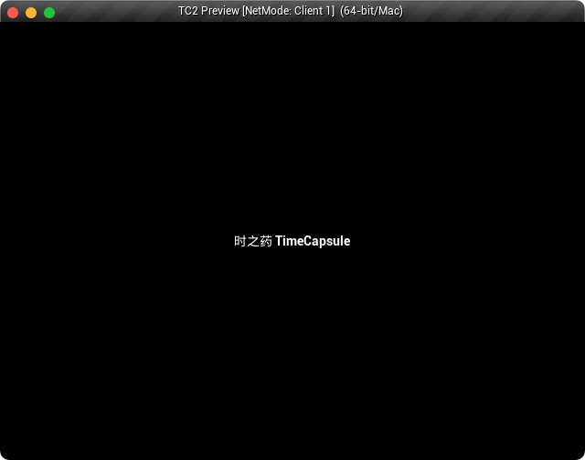
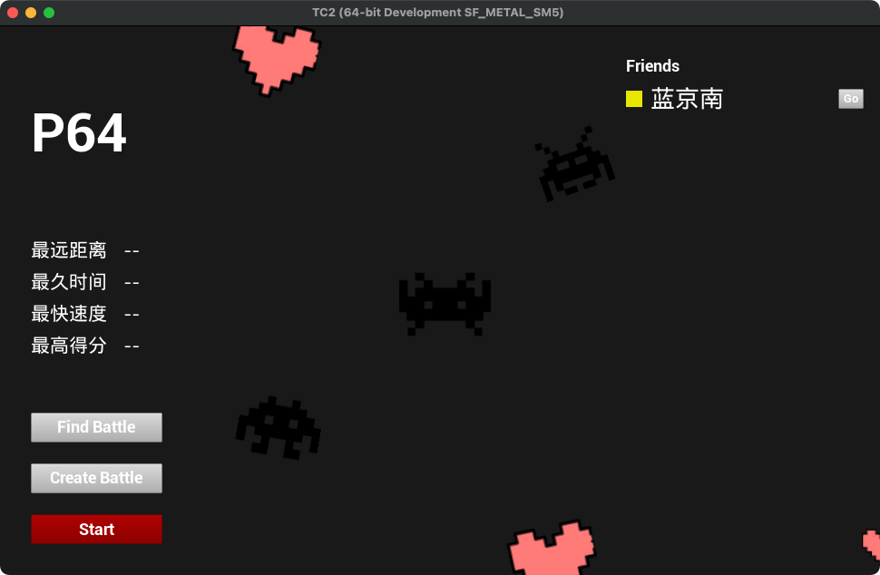
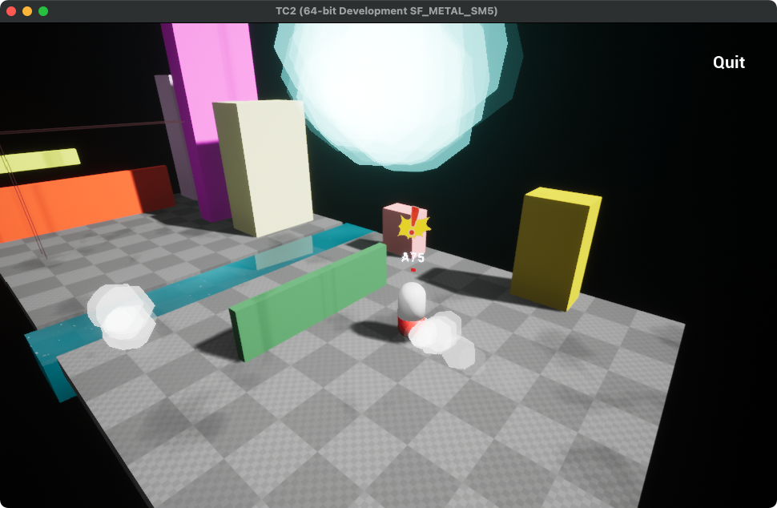
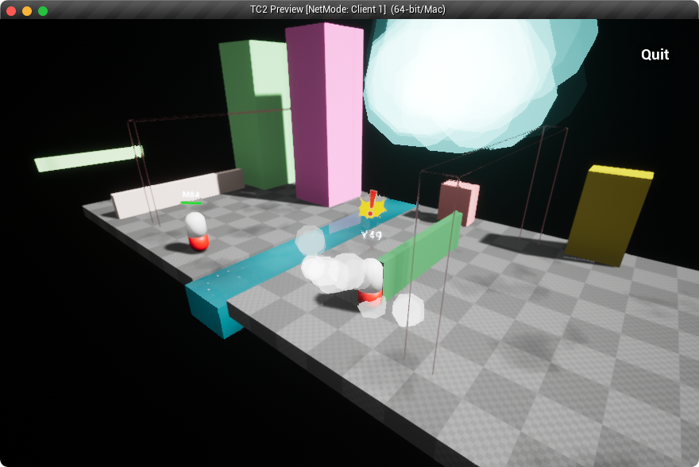
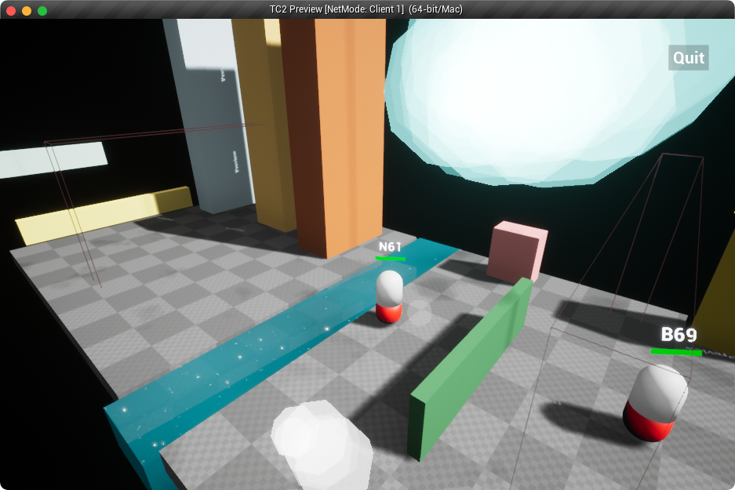
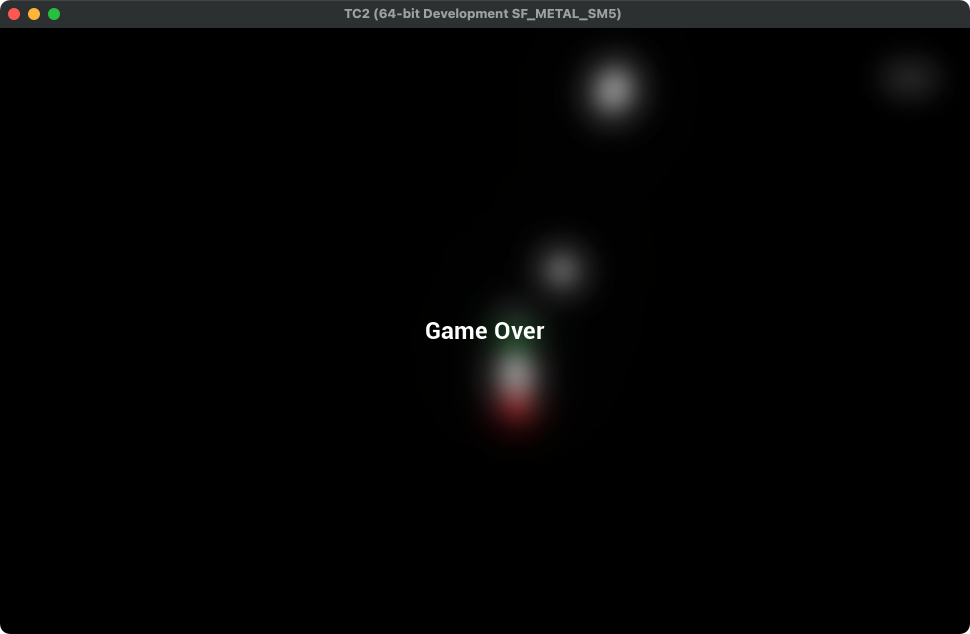
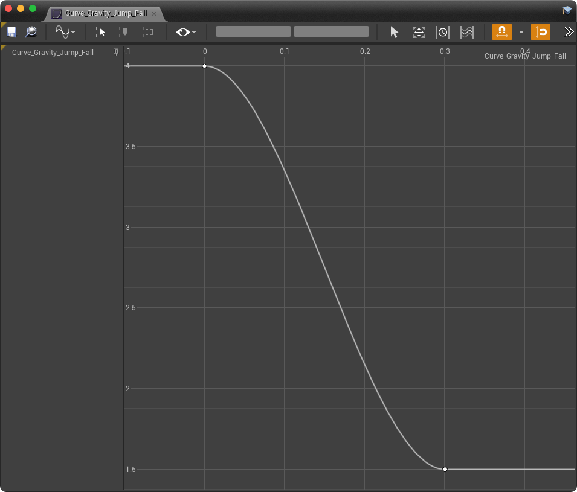
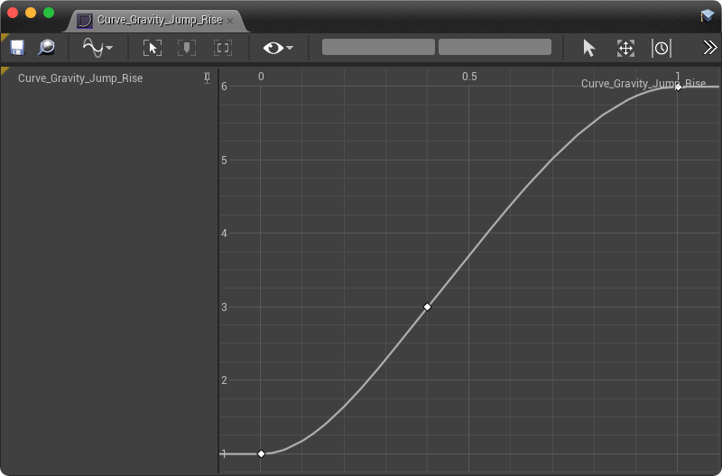

# TC2
A multiplayer parkour game based on Unreal Engine, inspired by Chrome dinosour.

# Operation
`W` `S` move forward & backward

`A` `D` move right & left

`Space` `Left` mouse button jump

# Snapshots

# 操作感调校
1. Movement Lerp：typically axis value is -1, 0, 1. if directly set to `scale`, it will cause rapid changes of the character speed.
2. Gravity:
    - Jump rise & fall: Mario style
        
        
    - Impulse ( shock )
3. Moving dust: if the speed exceeds a certain threshold, there should be some environment react, such as dust, footsteps.
4. Camera shake
